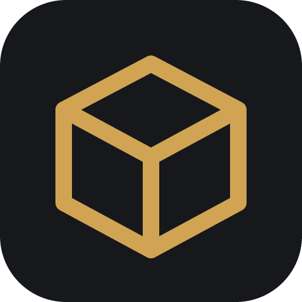
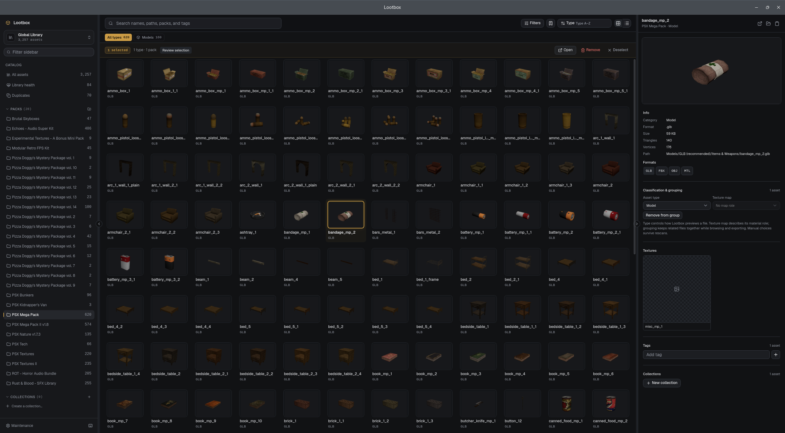

<p align="center">
  
</p>

<h1 align="center">Lootbox</h1>

<p align="center">
  A local desktop asset browser built for game developers.
</p>

<p align="center">
  
</p>

Lootbox is a local asset manager that indexes all of your asset packs into one searchable library. It allows you to preview all your asset types, and export selected files directly into a Godot project without modifying the original source directories.

## Features

- 3D model, image, and audio previews
- Automatic PBR texture map grouping
- Direct export to Godot projects
- Fast search, tags, and collections
- Duplicate file detection
- Non-destructive (never modifies source folders)

## Why?

Built as a tool for myself so that I can browse all of my asset packs in an easy way. This also means that lootbox might be quite opinionated.

## Development

```sh
npm install
npm run tauri dev
```

### Build

```sh
npm run check
npm run tauri build
```

## License

GPLv3
